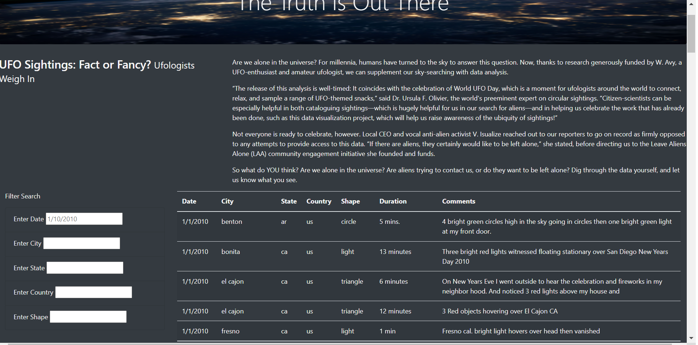
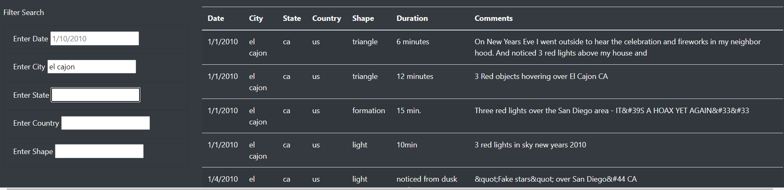

# UFOs

## Overview of Project
A journalist is preparing an article to post on UFO sightings in the city of McMinnville, OR. To support her article, she requires her data to be rendered in html, and that can be filtered by the various attributes of each sighting.

## Results
The HTML page that was created will initially load all of the data available in the *data.js* file.

JavaScript allows to filter the table by using the input fields on the left. 

*HTML page on initial render.*

Upon typing on a textbox field (and after focusing the mouse elsewhere), the table is automatically filtered by that criteria. Additional filtering can be applied if adding values on other input fields. By clearing values from any text field, the table is updated to reflect the removal of said criteria.

*HTML page after filtering.*

## Summary
One drawback of this design is that making changes to filter criteria can be cumbersome. This design can be benefited from the addition of a "clear all" button.

Some recommendations for further development:
- Input field validation to verify that the selected criteria is present in the data, would be helpful.
- Some fields where the values available are more narrow, such as country and state, could benefit from the use of dropdowns, instead of input text fields.